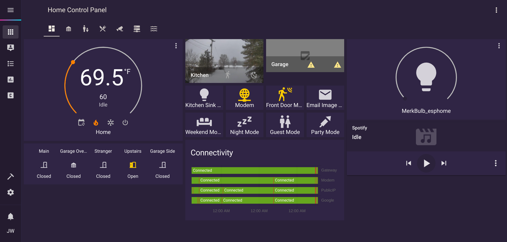

# Personal Home Assistant Configuration

## About
This is the configuration for my personal [HomeAssistant](https://www.home-assistant.io) instance. HASS is installed in Docker and this config requires a few more contianers. [Mosquitto](https://hub.docker.com/_/eclipse-mosquitto),[NGINX](https://hub.docker.com/_/nginx), and [Xbox-Smartglass-REST-Python](https://hub.docker.com/r/williamson10/xbox-smartglass-rest-python).

The Xbox Smartglass container was authored by [OpenXbox](https://github.com/OpenXbox/xbox-smartglass-rest-python). I used their Dockerfile and built it on Docker Hub.

## Automations
Automations are built and maintained in [Node-RED](https://nodered.org/).
I would like to add the flows themselves into either this repo or on their own. For now I will add a few screenshots below.
 

 
